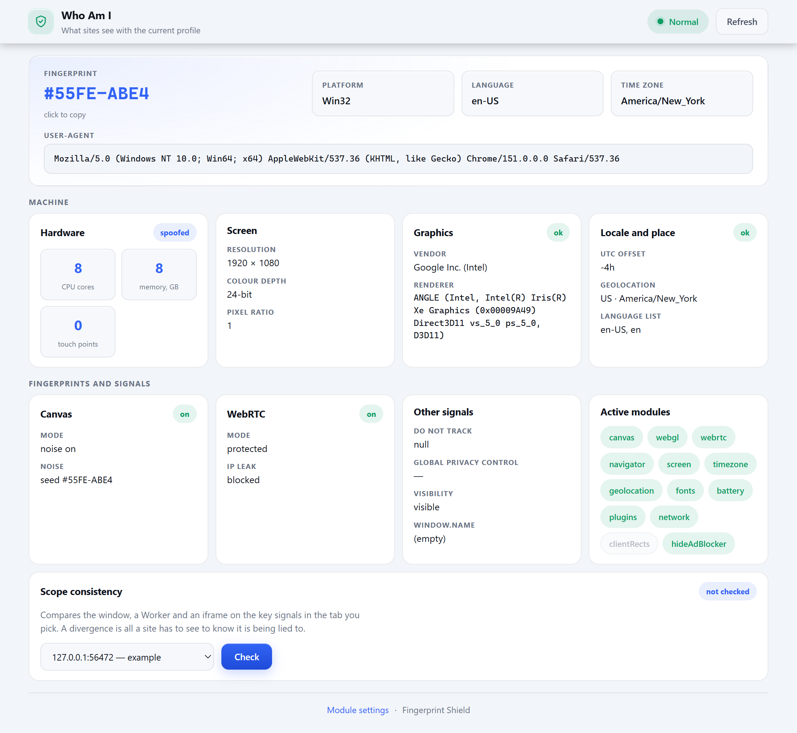
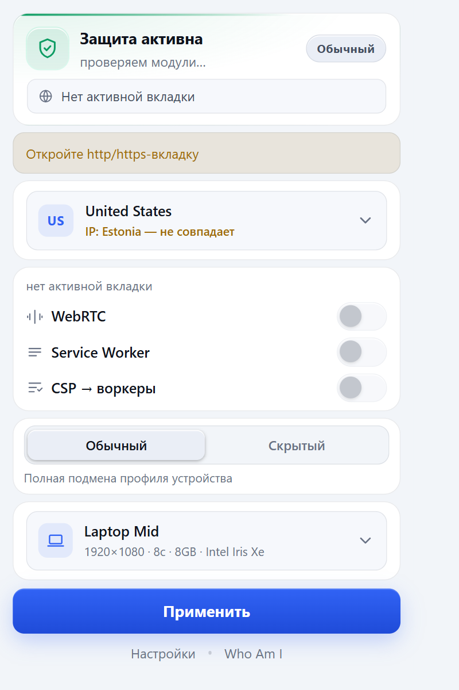
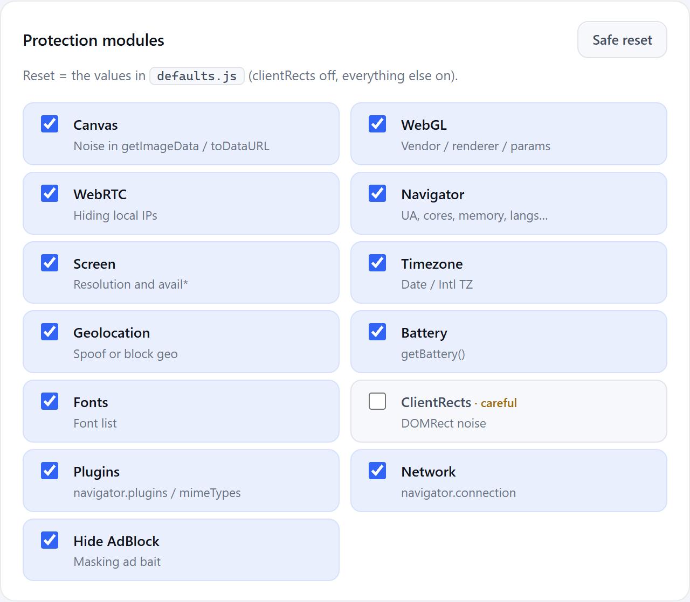

<div align="center">

# Fingerprint Shield

**Одна согласованная выдуманная машина — та же самая в окне, в каждом фрейме и в каждом воркере.**

[](https://github.com/N0deZ3r0/fingerprint-shield/actions/workflows/ci.yml)


[English](README.md) · **Русский**

</div>

Согласованность здесь и есть суть. Сайт опознаёт вас не отдельным значением, а тем, что
значения сходятся между собой. Заявить экран 1366×768, когда раскладка доказывает, что окно
шире, или отвечать из профиля в `matchMedia`, пока CSS-движок отвечает из настоящего
дисплея, — это не спрятать машину, а собрать машину, которой не бывает. Такая встречается
реже, чем та, с которой вы начали.

За каждой правкой здесь стоит измерение, и каждый сьют сравнивает результат с чистым
браузером, а не с предположением.

<div align="center">



<sub><b>Who Am I</b> — машина такой, какой её читает сайт. Каждое значение на этой странице
— это заявка, а не хозяйская машина; хеш отпечатка наверху — то, за что зацепится трекер.</sub>

</div>

## Установка

В Chrome Web Store расширения нет — ставится распакованным.

1. Скачайте zip из [релизов](https://github.com/N0deZ3r0/fingerprint-shield/releases/latest)
   и распакуйте. Его собирает CI из того коммита, на который стоит тег, и внутри только
   расширение: без dev-страниц, без сьютов, без генераторов.
2. Откройте `chrome://extensions/` и включите **режим разработчика**.
3. Нажмите **Загрузить распакованное расширение** и укажите распакованную папку.

Чтобы запустить из исходников, укажите там же клон этого репозитория.

## Как это выглядит

<table>
<tr>
<td width="38%" valign="top" align="center">



<sub>Попап: страна, посайтовые переключатели, профиль устройства.</sub>

</td>
<td width="62%" valign="top" align="center">



<sub>Тринадцать модулей, включаются по одному. `ClientRects` выключен по
умолчанию — именно от него краснеет CreepJS.</sub>

</td>
</tr>
</table>

## Чем это проверено

```bash
npm ci
npm test           # 9 узловых сьютов — секунды, без браузера
npm run test:all   # добавляет 40 браузерных сьютов — шесть-восемь минут
```

Всего **49 сьютов**. Узловая половина идёт на каждый push и каждый pull request; в неё
входит `test/parity-static.mjs`, который заново прогоняет оба генератора в памяти и падает,
если `mw-bundle.js` или `dyn/` на диске устарели. Браузерная половина по-настоящему грузит
расширение в Chromium и запускается вручную — её утверждения состоят из фактов о Windows:
строки рендерера ANGLE, список шрифтов, `outerHeight - innerHeight`.

Два стоит назвать отдельно. `clean vs ours` сравнивает пропатченный браузер с
непропатченным и падает на любом различии, которое никто не рассудил. `timezones vs ICU`
сверяет 941 утверждение о часовых поясах с тем ICU, что зашит в Node, — поэтому версия Node
и закреплена.

Популяционный справочник `tools/crowd-reference.json` списан с названных публичных
источников на названную дату — StatCounter для разрешений экрана, аппаратный опрос Steam для
видеокарт, — и рядом с каждым источником записано, чем его выборка перекошена. Ничего там не
интерполировано и не округлено на глаз. Где числа нет в источнике, инструмент печатает
прочерк, а не догадку.

## Пределы

Чего это расширение заведомо **не** закрывает. Правило попадания в список: сайт может это
прочитать, и мы знаем, что помешать не можем — либо платформа не даёт, либо закрытие стоит
дороже самой утечки. Номера пунктов используются как адреса из кода и со страницы аудита,
поэтому не перенумеровываются.

1. **Машина — это 2.6 бита.** Табличных профилей шесть. Сайт, читающий только железо —
   экран, ядра, память, GPU, — видит одну из шести машин.
2. **Аудио и текстовые метрики — хозяйские.** `OfflineAudioContext` считает на настоящем
   звуковом стеке этой машины. Текстовые метрики шумятся, аудио — нет.
3. **Readback WebGL зашумлён, но не контролируется.** Шум — не подмена: сайт, у которого
   есть эталон этой видеокарты, увидит «не она», а не «вот эта другая».
4. **GPU подменяется только на уровне строки.** `UNMASKED_RENDERER_WEBGL` и `GPUAdapterInfo`
   отвечают из профиля; всё, что реально считается на карте, — нет.
5. **Собственный service worker сайта читает настоящую машину.** Измерено на одной странице:
   16 ядер против 18, `Europe/Berlin` против `Europe/Moscow`.
6. **На origin с `trusted-types` машина становится хозяйской** — согласованно. Создание
   политики порождает нарушение, которое браузер строит в C++ по настоящему стеку и называет
   в нём расширение; из JS до этого не дотянуться.
7. **Экран становится хозяйским, когда окно шире заявки.** Экран не может быть меньше окна,
   и один `100vw` доказывает нижнюю границу.
8. **`@media` и `matchMedia` расходятся по нескольким признакам.** `matchMedia` отвечает из
   профиля, CSS-движок — из настоящего окна, а до CSS-движка не дотянуться.
9. **Окно установки.** Первые секунды после установки или перезагрузки динамические
   DNR-правила ещё не зарегистрированы. Заголовки, утекавшие в этом окне —
   `accept-language`, а это страна, — перенесены в статический ruleset и теперь закрыты.
10. **Канвас, прочитанный inline-скриптом во время разбора документа,** получает значения по
    умолчанию: решение о фиче замораживается при первом использовании.
11. **Геометрия окна до того, как браузер её узнал.** В первом inline-скрипте
    `outerWidth`/`outerHeight` равны `0`. Мы отдаём этот `0` дальше — ровно как чистый браузер.
12. **Страна выхода — единственная ось, которой внутренняя связность не видит.** Все сьюты
    спрашивают, не противоречит ли сборка сама себе. Ни один не может спросить, совпадает ли
    заявленная страна с сетью, из которой трафик реально выходит.
13. **Первый визит на origin, отказывающий blob-воркерам.** Каждый воркер, который патчит
    расширение, строится из blob; origin, чей CSP не пускает `blob:`, такую конструкцию
    отвергает.
14. **TLS и HTTP/2 недосягаемы.** Набор и порядок шифров, расширения TLS, ALPN, кривые,
    кадр SETTINGS в HTTP/2 — JA3/JA4 и отпечаток h2 складываются до того, как страница
    получит первый байт, и Cloudflare с Akamai читают их штатно.
15. **Декодер и список кодеков WebRTC — это видеокарта, а не таблица.** `decodingInfo()`
    отвечает `powerEfficient` из того, есть ли у настоящей карты аппаратный декодер, а
    `getCapabilities('video')` показывает `video/H265` только там, где железо умеет HEVC.
16. **Предупреждение WebGL о неизвестной константе называет нас.** Chrome приписывает
    `INVALID_ENUM` ближайшему скриптовому кадру, а это наша обёртка.

17. **Имена двух маркеров фиксированы.** `'__t0' in window` отвечает «да» для этой сборки
    и «нет» для чистого браузера — и в верхнем документе, и во фреймах; `__AFP_PATCH_URL`
    делает то же в скоупе воркера. Они неперечислимы, поэтому диффу имён против свежего
    iframe не видны, но постоянную строку достаточно увидеть один раз. Вывести их из сида
    мешают два обстоятельства: маркеры ставятся раньше, чем сид известен, и их читают
    проверки в живом браузере.

Тот же список лежит на странице аудита расширения рядом с вердиктом — потому что зелёный
вердикт ровно настолько широк, насколько широк список заданных вопросов.

## Чем это перемерить

```bash
node tools/probe-diff.mjs     # что сборка МЕНЯЕТ против чистого браузера
node tools/probe-time.mjs     # что меняется во ВРЕМЕНИ и не меняется у чистого
node tools/probe-crowd.mjs    # размер толпы, в которую вы попадаете
node tools/diff-metrics.mjs   # две машины: что различается между ними
node test/hostleak.mjs        # хозяйские значения, которые пролезают
```

## Сборка

```bash
npm run build         # пересобирает dyn/ и mw-bundle.js
node tools/pack.mjs   # собирает dist/ — только расширение, 243 файла
node tools/shots.mjs  # переснимает скриншоты выше с работающего расширения
```

`mw-bundle.js` генерируется из одиннадцати модулей в `mw/`. Правьте модули, а не бандл:
`npm test` падает, если бандл на диске устарел.

## Участие в разработке

Баг-репорты и пул-реквесты приветствуются — см. [CONTRIBUTING.md](CONTRIBUTING.md). Нашли
уязвимость? [Сообщите приватно](https://github.com/N0deZ3r0/fingerprint-shield/security/advisories/new),
а не публичной задачей.

## Лицензия

[MIT](LICENSE).
